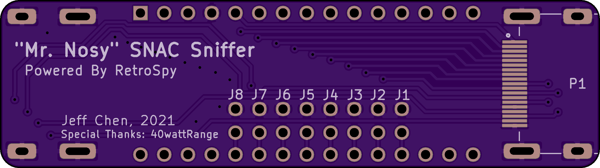

# Mr Nosy SNAC Sniffer

”Mr. Nosy“” SNAC Sniffer is a hardware iteration that's powered by the [RetroSpy](https://github.com/retrospy/RetroSpy).

I've created three versions. The long with the impression of an inline design. The square can be set up to hide the wires behind it. The "L" is a shorter & more compact design of the long.

-------------
## Parts

- Arduino Nano

- Pin Headers, 2.54mm-pitched

- 2x15 Socket, 2.54mm-pitched, 0.6" Row Spacing (Optional)

- HDMI Female Socket, Through Hole
  - https://www.aliexpress.com/item/4000348824214.html

- Jumper Caps

- "Mr. Nosy" PCB
  - Long Version: https://oshpark.com/shared_projects/CRrWdsM4
  - Square Version: https://oshpark.com/shared_projects/UYfhPj0N
  - L Version: https://oshpark.com/shared_projects/WcJKoEXY

-------------

## Assembly

Assembly is pretty straight forward. Parts belong to the side with silkscreen printings.

Note on the long version, the two HDMI headers are on different sides. Remember to solder the jumper headers before soldering the Arduino or its socket, otherwise it will be kind of hard to do afterwards.

-------------
## Special Thanks

@40wattRange
- https://twitter.com/40wattrange
